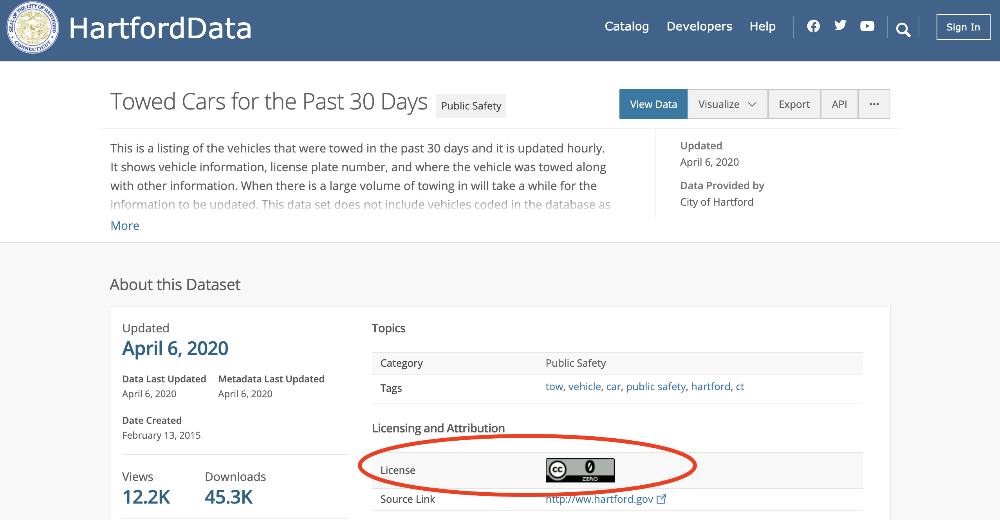
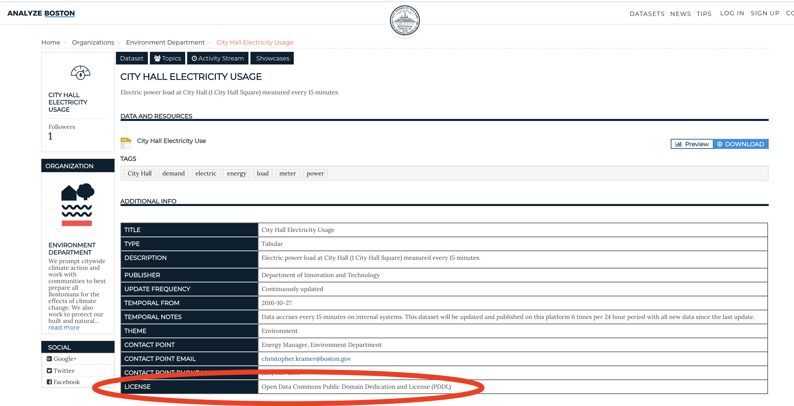
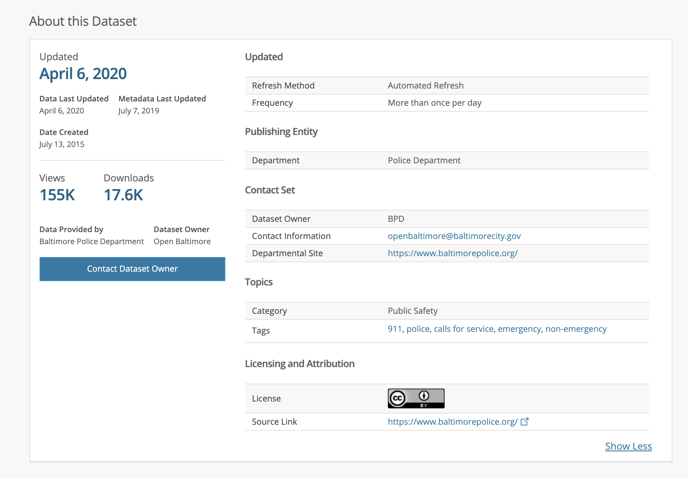
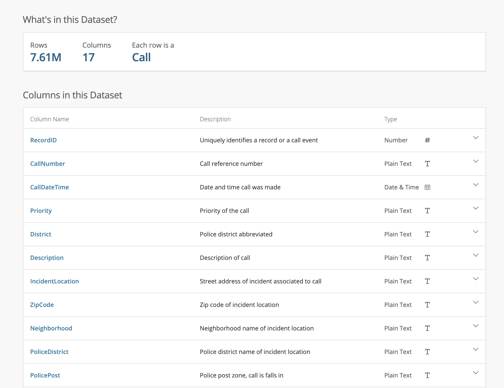
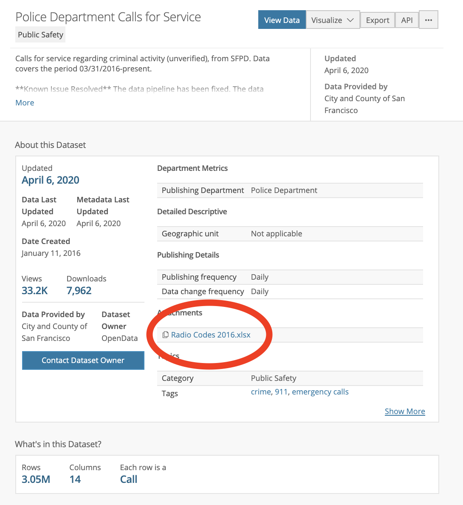
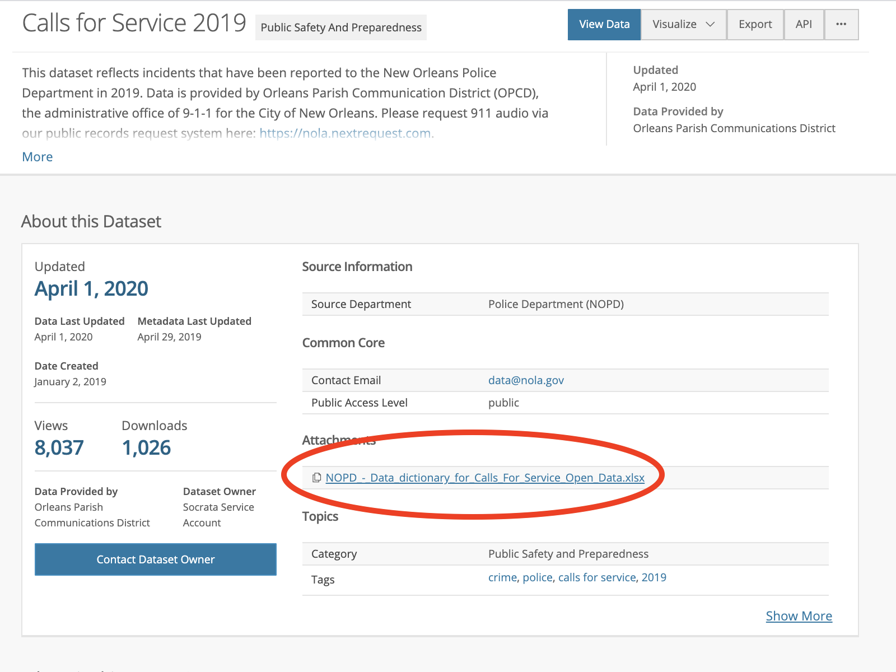
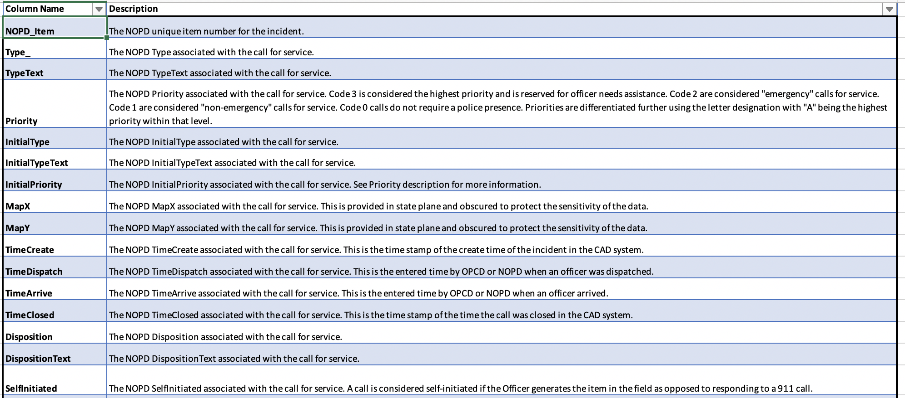

## Instructions and Overview

In this lab, you will begin to outline a research plan for a project analyzing data regarding social vulnerability in the wake of a pandemic. In your groups on Tuesday, you selected a topic for data investigation. This will be the topic you write about in this lab. At this point, we are just documenting what we currently know about our topic and what questions we have regarding the topic. In the second part of the assignment, you will begin searching for data that could help address some of the empirical research questions that you devise. At the end of the course, we will come back to this lab to document how our understanding of the topic has changed following several weeks of working with data. 

In some sections of this document, you will need to fill in responses to questions. In two sections, you will need to fill in tables. Be sure to read the document carefully so that you know where you will need to respond.

## Background

I've included news articles below for each of your project groups that discuss some of the issues related to your topic. I'd recommend that you read through the article corresponding to your topic first to get a sense of how your topic is being discussed today. If you can't access the article, send me a note on Slack, and I will send you a PDF.

### Healthcare

['It's a racial justice issue': Black Americans are dying in greater numbers from Covid-19](https://www.theguardian.com/world/2020/apr/08/its-a-racial-justice-issue-black-americans-are-dying-in-greater-numbers-from-covid-19)

### Food Security

[‘Never Seen Anything Like It’: Cars Line Up for Miles at Food Banks](https://www.nytimes.com/2020/04/08/business/economy/coronavirus-food-banks.html)

### Domestic Abuse

[A New Covid-19 Crisis: Domestic Abuse Rises Worldwide](https://www.nytimes.com/2020/04/06/world/coronavirus-domestic-violence.html)

### Income Security

[For Millions of People, Relief From the COVID-19 Stimulus Package Remains Out of Reach](https://time.com/5816775/coronavirus-unemployment-stimulus/)

### Environment

[New Research Links Air Pollution to Higher Coronavirus Death Rates](https://www.nytimes.com/2020/04/07/climate/air-pollution-coronavirus-covid.html)

### Infrastrucutre for Remote Work

[COVID-19 shines light on 'digital divide' across the US](https://www.cnet.com/news/covid-19-shines-light-on-digital-divide-across-the-us/)

## Research Plan

To begin your research plan, please respond to the questions below in full sentences. At this point, you do not need to do external research on your topic. You are simply documenting what you currently know about your topic. **Note that we will focus all our research in the context of the US. The only reason for this is that if we were to focus on topics in other countries, much of the public data would not be available in English, which would make it difficult for groups to collectively work with it.**

### What topic am I investigating? (just one phrase here is fine.)

```{r eval=FALSE}
Fill response here. 
```

### Why is this topic relevant to contemporary public health or social vulnerability in the wake of a disaster?

Why is this topic relevant to discuss in the context of a pandemic?

```{r eval=FALSE}
Fill response here. 
```

*Empirical research questions* are questions that an analyst can assess evidence to address. Examples of social-theoretical questions include:

* Do United States hospitals have enough beds to accommodate the expected influx in Covid-19 cases? At what point will there not be enough beds available?
* In which US states are hospitals better equipped with beds and staff to take on an influx in patients over the course of the next month?

Empirical research questions are specific to a particular time and place. Notice how I delimit my questions to the US above and the second question to a specific month. Now think about your topic. What questions could you ask about your topic that would contribute to an understanding of the social vulnerabilities and strucutral inequalities that shape how people experience the pandemic? Be sure that your question is one that you can assess evidence to address, and that it is specific to a certain time and place. If your topic is mental health, you might ask:

* In 2020, how many people in the United States have insurance that covers therapy visits?

Note how, with the right data I could answer this question definitively.

### What empirical research questions might I address in my research? List at least two.

```{r eval=FALSE}
Fill response here. 
```

> Beware of setting up your question as a dichotomy! Did you use the word 'or' in your question above? I've seen many students do this in past assignments - asking questions like "Was this legislation beneficial to local communities, or was it harmful?" or "Did this technology fix inequities in the community, or did it sustain them?"  In each of these questions, we have structured our research to test two conditions only. Yet, when it comes to studying complex contemporary issues, things are never black and white. It is highly likely that the situation we are examining in our research is much more complicated than these two conditions can capture. We should avoid structuring our research questions to test mutually exclusive categories.  In placing false dichotomies in our research questions, we run the risk of oversimplifying complex causation, and we limit what the research can say.  

*Social-Theoretical questions* are questions about how certain social, political, or environmental phenomena operate at a broad scale. They are much broader than empirical research questions. We often cannot answer these questions with one research project. However, we often aim to increase understanding of these questions through a research project. Examples of social-theoretical questions include:

* How has the United States prioritized critical health infrastructure?
* How do national hospital business models implicate social vulnerability in the wake of a public health crisis?

Note how for each of these questions I would need to examine lots of different data and carry out a number of different projects. This whole class will be asking the social-theoretical question:

* How are existing strucural inequalities exacerbated in a pandemic?

Now think about your topic. What broader questions about how social, political, or environmental phenomena operate might you wish to address through research?

### What social-theoretical questions might I address in my research? List at least two. 

```{r eval=FALSE}
Fill response here. 
```

### What data do I believe exists about this topic?

Fill response in the table below. In front of the '|' list a dataset that may exist about this topic. Behind the '|' mark whether you believe such a dataset is accessible.

Dataset | Do you think this data is accessible?
-------- | --------
Number of cases of Covid-19 globally  | Yes
Fill | Fill
Fill | Fill
Fill | Fill
Fill | Fill
Fill | Fill

---

## Project Contexts

At this point, we are going to begin mapping out some of the project contexts. By this I mean that we are going to put your topic into temporal, geographic, and social-cultural perspective. Imagine that your topic is somehow depicted in the center of a plain white sheet of paper. What details would we need to fill into the background in order to bring this topic to life? We would need to add people. We would need to add environments. We would need to communicate the time and place in which the topic was being depicted. The eight questions below encourage you to draw out these contexts. Note that there is not necessarily a wrong way to answer these questions, and you absolutely do not need to answer them comprehensively. If we tried to respond to them "fully," we'd probably go on writing forever! Instead I'd like you curate just a few things that come to mind when you consider your topic in relation to the questions. Having some of these contexts written out will help you as you are searching for data. For each question below, please respond in 1-2+ complete sentences. 

### What are some key events, dates, or years relevant to this topic? This might be a long span of time or a specific event. 

```{r eval=FALSE}
Fill response here. 
```

### What are some key sites, locations, or geographies relevant to this topic? This might be a large boundary like a country or a small community. 

```{r eval=FALSE}
Fill response here. 
```

### What social groups are impacted by this topic, and how?

```{r eval=FALSE}
Fill response here. 
```

### How is the environment implicated in this topic?

```{r eval=FALSE}
Fill response here. 
```

### How is the economy implicated in this topic?

```{r eval=FALSE}
Fill response here. 
```

### How are politics implicated in this topic?

```{r eval=FALSE}
Fill response here. 
```

### How are you implicated in this topic?

```{r eval=FALSE}
Fill response here. 
```

### What are some of the most common ways different social groups talk about this topic?

```{r eval=FALSE}
Fill response here. 
```

---

## Background on Open Government Data

In May 2009, Data.gov - a web portal for accessing US government datasets - was launched by then federal Chief Information Officer Vivek Kundra. Following this, in December 2009, then US President Barack Obama signed the Open Government Data Directive, requiring that all federal agencies post at least 3 high value datasets on data.gov within 45 day. A few years later in May 2013, Pres. Obama signed an Executive Order to: "M"ak[e] Open and Machine Readable the New Default for Government Information." 

<iframe width="560" height="315" src="https://www.youtube.com/embed/n603rEnEGXA" frameborder="0" allowfullscreen></iframe>

The Order required that the US Office of Management and Budgeting, in collaboration with the CIO and CTO, put out and oversee an Open Data Policy. This policy required the following:

* Data needs to be published in machine-readable formats
* Data needs to be licensed openly
* Data needs to be described with metadata

See [here](https://www.whitehouse.gov/sites/whitehouse.gov/files/omb/memoranda/2013/m-13-13.pdf ) for more details. 

Note that these are only requirements for data produced through the federal government. Cities, states, and counties have their own open data programs, policies, and laws, which are sometimes more and sometimes less stringent than the federal policy. However, most open data policies, in some way, deal with the three issues listed above - machine-readability, licensing, and metadata.

Let's talk about what each of these issues entail:

### Machine-readable

Last quarter, in my Hack for California research cluster, one project was examining gentrification over the past ten years around and near the UC Davis Medical Center in Sacramento. One of the indicators we were examining in relation to gentrification was the number of construction permits the city had awarded in that area for demolitions, new buildings, and remodeling. The City of Sacramento has construction permit data from 2012 to present stored in Excel files on [their website](https://www.cityofsacramento.org/Community-Development/Resources/Reports/Permit-Data-Reports/Issued-Permit-Reports) - one file of permits per month. One of the students in the research cluster (and in fact one of your stellar classmates) was able to write a script to download each of these files and bind them into one large file. However, we were examining gentrification over a much longer period of time and needed construction permits dating back to 1990. We knew that the City had this data because they had produced a [public map](https://sacramento.civicinsight.com/), where you could search for an address in Sacramento and retrieve every construction permit it had been awarded since the early 1980s. We needed a data file that listed this for every address in the city. With this in mind, I submitted a [public records request](https://sacramentoca.mycusthelp.com/WEBAPP/_rs/(S(gtpitddl4wacmgidw55lm4bz))/SupportHome.aspx) asking for the following: "I'm looking for a data file of all construction permits issued across Sacramento from 1990 to present in a downloadable, machine-readable format."

Two weeks later they sent me back a 9,543-page PDF document listing every construction permit awarded in the city since 1990. I took a deep breath. Had they sent this in a CSV file, we could have gotten to work immediately. It would take hours to get this hefty document into a format we could work with. I really hate PDFs.

Machine-readable data are data that can be readily processed by a computer. Typically machine-readable data are structured in ways that many different computer applications can recognize. As my story above indicates, there are different degrees of machine-readability of digital data:

* Data stored in tables in **PDFs (files with extension .pdf)** are perhaps some of the least machine-readable data that we will encounter in our data research. This is because data in tables in PDFs are not structured in such a way that computer software can easily reference and operate on specific values. 
* Data stored in **Excel (files with extension .xls)** files are a bit more machine-readable. We can import data stored into an Excel file into Excel, and the software will recognize how the data are structured, aggregate values into separate cells, and thus present it to us in a way that we can operate on it. However, to open Excel, we need access to Microsoft products, which we have to pay for. This means that the Excel file is not stored in an open format.
* Data stored in **Comma Separated Value (files with extension .csv)** files are more machine-readable than data stored in Excel files. This is because data in CSV files are structured in an open format - or a format that is not dependent on proprietary software. A CSV file is a text file structured so that each line in the file designates a record and various fields for describing that record are separated by commas. If we were to open a CSV file in a basic text editor, it would look something like this:

Name, Age, Birth Month, Time on Phone

Sally, 23, 3, 42

Julie, 40, 2, 98

Mark, 14, 8, 120

However, if we were to open the same file in Excel, each value would be separated into its own cell. A CSV file is software independent. As a standardized way of displaying data, just about any computer application that displays data is prepared to read a CSV file and format it for display. 

While we won't work with such formats in this course, data can be made even more machine-readable than a CSV file. Formats like XML and RDF allow us to structure data with much more specificity. They are often considered the gold standards of machine-readability. Sir Tim Berners-Lee, the inventor of the World Wide Web, often uses this diagram to outline the degrees of machine-readability of open data (if you want to really get me going, ask me the difference between the Internet and the Web!):


In the above chart, the acronyms are short for the following:

* OL: Available *online*
* RE: Machine-*readable*
* OF: *Open format*
* URI: Each observation has a *unique resource identifier* so that we may refer to it persistently
* LD: Data is *linked* to other datasets

### Licensed Openly

Just because something is available on the Web does not necessarily mean that we are free to download and use it as we please. Historically, different government agencies would allow access to certain datasets for a fee that would help to cover the costs of running public data programs. (Oftentimes, we hear this referred to as data being behind a "paywall.") With the US Open Government Directive, all data *produced* by any federal US agency would default to the public domain. When data is in the public domain, they are owned by the the public. The data are not subject to any copyright or intellectual property law and can be accessed, modified, reproduced, and distributed without any restrictions. 

Data *acquired* by any federal US agency needed to be given an open data license that met the following criteria:

1. The license allowed for data reuse and modifications.
2. The license could not restrict any form of redistribution of the data.
3. The license could not discriminate any person or group from these rights. 

There are a few global licenses that government agencies can apply to data that meet this criteria. One such license is the Creative Commons Universal Public Domain License (CC0 1.0). 

Creative Commons is a non-profit organization that aims to increase the availability of creative works that the public can remix and share. Creative Commons has created a number of free licenses that the public can apply to their own creative works in order to designate the extent to which others can modify and redistribute them. These licenses indicate whether individuals other than the content creator may share the work, remix the work, and/or make money off of the work, along with whether such individuals have to attribute the content creator when sharing it. The following image outlines a number of Creative Commons licenses from most open to least open. You'll notice that CC0 1.0 - the license compatible with each of the criteria listed above is at the top of the image. 


> In the image above, BY means that the license requires that the content creator be attributed whenever the creative work is shared. SA means that the license requires that any derivatives of the original work be given the same license as the original work. NC means that the license restricts the work from being used for commercial purposes. ND means that the license restricts other individuals from modifying the original work. 

See [this](https://data.hartford.gov/Public-Safety/Towed-Cars-for-the-Past-30-Days/hefc-wgp8) dataset of Towed Cars for the Past Thirty Days in Hartford, CT, which has been licensed with the CC0 1.0. 



Another open license that meets the criteria listed above is the Open Data Commons Public Domain and Dedication License (PDDL). You can read more about the specifics of this license [here](https://opendatacommons.org/licenses/pddl/1.0/). See [this](https://data.boston.gov/dataset/city-hall-electricity-usage) dataset of City Hall Electricity Usage in Boston, which has been licensed with the PDDL:


Different cities and states throughout the US will have different laws about the degree to which data should be openly licensed. In most open government data portals, you will be able to discern how data licensed in its administrative metadata - to which we will turn next. 

### Metadata

Metadata is data about data. There are two kinds of metadata:

1. Administrative metadata: data about how a dataset is/should be managed
2. Descriptive metadata: data about what is inside a dataset

Administrative metadata will answer questions such as: 

* Who created this data?
* When did they create it?
* When was it last updated?
* How often will it be updated?
* Who published it?
* Who owns the data, and how is it licensed?

Check out the administrative metadata available for [this](https://data.baltimorecity.gov/Public-Safety/911-Police-Calls-for-Service/xviu-ezkt) open dataset detailing Baltimore 911 Police Calls for Service. Here is a screenshot of the linked page:


Under the About this Dataset section on the page, you'll see a number of fields describing the data - how frequently the data is updated, who published the data, who to contact regarding the data, who has rights to use and distribute the data, when the data was created, and when the data was last updated. All of this metadata provides us with information about how this data is managed; in other words, it provides administrative metadata. Why is administrative metadata so important? Here are just a few reasons:

* If we run into errors in the data or if we have questions regarding the data, we need to know who to contact.
* We need to know how often it is updated to get a sense of its timeliness. Data that is rarely updated may be less relevant than they were when first published.
* We need to know how it is licensed so that we understand whether we have permission to use it, to distribute it, or to publish it.
* We need to know who created it in order to understand what perspective the data represents. 
* Just like when we cite quotes in a paper, we need to cite data when we reference it. All of this information communicates to us how to cite the data. 

As an example of why this is important, consider [this](https://www.denvergov.org/opendata/dataset/city-and-county-of-denver-traffic-accidents) dataset documenting traffic accidents in Denver. There is a long preamble to the data, indicating important information about how the dataset gets updated. Every time an accident occurs it is entered into the dataset. However, when first reported, the Denver Police Department likely does not have all of the information about the accident. That information becomes available through investigations, and as it becomes available, the entries associated with that accident in the dataset are updated. The following disclaimer on the data portal provides important administrative metadata:

> "Incidents that occurred at least 30 days ago tend to be the most accurate, although records are returned for incidents that happened yesterday. For motor vehicle crashes that are still under investigation and involve a serious bodily or fatal injury, some attributes will appear as, "UNDER INVESTIGATION." This is to help ensure that any court proceedings related to these incidents are not inadvertently hindered. Once the investigation is closed, all of the incident's attributes will be visible. This dynamic nature of motor vehicle crash data means that content provided here today will probably differ from content provided a week from now. Likewise, content provided on this site will probably differ somewhat from crime statistics published elsewhere by the City and County of Denver, even though they draw from the same database."

While administrative metadata characterizes how the data is managed, descriptive metadata tells us about the content of a dataset. With descriptive metadata, we should be able to answer questions such as:

* How many columns are in the dataset, and how many rows?
* What does each row represent?
* What does each column name refer to?
* What are the possible values in each column?
* How was the data collected, and what standards of measurement were used?
* What assumptions were made when the data was collected, and how will those assumptions be presented in the data?

Check out some of the descriptive metadata for the same Baltimore 911 Police Calls for Service above. 


As part of this basic descriptive metadata, we can see that there are 7.61 million rows in the dataset and 17 columns. We can see that each row (or observation) in the dataset represents a call, and we can see each of the columns (or variables) in dataset that describe a call. 

> This dataset is published in Baltimore's open data portal. Many cities, counties, states, and countries now have their own versions of an open data portal where various government agencies under their jurisdictions publish datasets. You'll notice that many of these portals look very similar. This is because, for the past decade, [Socrata](https://www.tylertech.com/products/socrata) - a company that has designed a data asset management platform specifically for open government - has become a go-to resource for opening government data. A considerable number of open data platforms run on Socrata and will thus look and feel similar.

As we continue our labs we are going to keep coming back to a key point: any count that we produce or any measurement that we produce will always be dependent on how we define what we are counting or measuring. If we are going to count the number of cars on the road, we have to ask: What counts as a car? What will I include in the count and what will I exclude? If we were going to measure the height of a chair, we have to ask: According to what units am I going to measure the height? The numbers that we produce will be shaped by the choices we make regarding data collection. Without documenting those choices, the values won't make much sense to others. Again, we must first define things in order to count or measure them. This is why it is so important that when we share our data, others can look up the definitions that we are using to produce our values. 

With this mind, descriptive metadata is often documented in what is called a data dictionary. Data dictionaries are tools for looking up what various variables and codes in a dataset refer to. With a data dictionary, a data analyst can look up how values were defined much like they would look up the definition of a word in the Oxford English Dictionary. For instance, San Francisco also publishes a dataset documenting [911 Calls for Service] (https://data.sfgov.org/Public-Safety/Police-Department-Calls-for-Service/hz9m-tj6z), and in addition to the information available above, they provide an attachment to a document identifying what number codes and abbreviations in the dataset refer to:

 

New Orleans also publishes a version of the [911 calls for service dataset](https://data.nola.gov/Public-Safety-and-Preparedness/Calls-for-Service-2019/qf6q-pp4b). They have created a separate data dictionary document for recording descriptive metadata about the dataset. 

 

> Check out [this](https://fivethirtyeight.com/features/which-cities-share-the-most-crime-data/) really nice piece on FiveThirtyEight, detailing the extent to which different cities and states have made crime data available for public analysis. 

Data dictionaries are often very important for crime data as there are a number of caveats to what can be publicly reported with regards to crime. Consider something I learned while working in NYC. 

```{r}
nyc_arrests <- read.csv("https://data.cityofnewyork.us/api/views/uip8-fykc/rows.csv", stringsAsFactors = FALSE)
```

NYC publishes a dataset documenting each arrest, the date it occurred, where it occurred, the crime suspected, and demographic details about the person arrested from the start of the year to the present.

```{r}
nyc_arrests %>% head()
```

However, for certain crimes, such as rape, sharing the location of where the crime occurred can put individuals at considerable risk. When we filter this data to only represent rape arrests that have occurred in Manhattan, and then map it, you will notice that there are very few locations represented on the graph - 19 at the writing of this lab. 

To view this map, enter the following into your console, and then run the code below:

install.packages("leaflet")

```{r}
library(leaflet)
library(tidyverse)

nyc_arrests %>%
  filter(OFNS_DESC == "RAPE" & ARREST_BORO == "M") %>%
  leaflet() %>% 
  addProviderTiles(providers$CartoDB.Positron) %>%
  addMarkers(~Longitude, ~Latitude)
```

Does this mean that only 19 arrests have been made for rapes in Manhattan since the start of the year? It does not. From examining the data documentation, we learn that unlike other crimes in NYC, the location of all rape arrests are geocoded in the dataset to the address of the police station house of the police precinct where the rape occurred. This is to protect the privacy and anonymity of the victim.

Some data dictionaries are very robust, detailing not only what each column refers to, but also the expected type of data in that column, every value that can appear in that column, where data might be missing in that column and why, and information about how the values in that column were generated. Other data dictionaries include much less information, forcing a data analyst to make assumptions about what values mean. Sometimes, a data dictionary is easily accessible with a dataset. However, sometimes, it can be much harder to find descriptive metadata - at times because it is buried within complicated user interfaces, and at other times, because it has not been created at all.

In an ideal world, we would have rich metadata for every dataset published on an open government data portal. Unfortunately, this is rarely the case. The robustness of the data documentation, along with its ease of accessibility, can indicate the extent to which data publishers have prioritized responsible stewardship of the data. It can also indicate the human, financial, and technical resources various governments have available for data management and stewardship. When I worked in NYC, there were some agencies that published dozens of datasets on the open data portal with just one person at their agency responsible for managing the publication and stewardship of all of those datasets, *in addition to that person's other duties*.

Notably, without descriptive metadata, it is much more likely that we will make poor assumptions about what certain terms mean in the data. If you ever find yourself in a situation where you don't know what a term in an open government dataset means, this is where administrative metadata can be important. Before drawing conclusions from the data, you should contact the designated contact person with a detailed message explaining points of confusion in the data. (You may also want to encourage them to document their response in a data dictionary!) In future labs, I will describe a number of examples where we have had to do this in past iterations of this course. 

---

## Dataset Hopping 

At this point in the quarter, you will begin to search for open government or academic datasets related to your chosen topic. You will not necessarily be working with these datasets. After aggregating lab 2 from everyone and reviewing which datasets will work in the context of this course, I will select one dataset for each group to examine for the quarter. 

I have some recommendations for how you go about searching for data, and I've listed them for each of the project groups below. However, please also feel free to search for data in city and state open data portals.

### Healthcare

* [https://data.medicaid.gov/](https://data.medicaid.gov/)
* [https://data.medicare.gov/](https://data.medicare.gov/)
* [https://data.healthcare.gov/](https://data.healthcare.gov/)
* [https://data.chhs.ca.gov/](https://data.chhs.ca.gov/)

### Food Security

* [https://www.data.gov/](https://www.data.gov/)
* [https://www.ers.usda.gov/data-products/](https://www.ers.usda.gov/data-products/)

### Domestic Abuse

* [https://www.data.gov/](https://www.data.gov/)
* [https://www.bjs.gov/](https://www.bjs.gov/) (Note that the data here are not particularly easy to work with, but I will help to download them when the times comes.)

### Income Security

* [https://www.data.gov/](https://www.data.gov/)
* [https://www.bls.gov/](https://www.bls.gov/) (Note that the data here are not particularly easy to work with, but I will help to download them when the times comes.)

### Environment

* [https://edg.epa.gov/metadata/catalog/main/home.page](https://edg.epa.gov/metadata/catalog/main/home.page)

### Infrastrucutre for Remote Work

I recommend searching some city open data portals such as:
* [https://opendata.cityofnewyork.us/](https://opendata.cityofnewyork.us/)
* [https://datasf.org/opendata/](https://datasf.org/opendata/)

> Last week there was a question about whether you could use datasets from Kaggle. You may. I will just ask you to consider the source of the data in the final question, and whether you find that source reputable. 

Based on your research, fill the datasets most suitable for examining your topic into the chart below. Be sure to respond to each of the questions in the chart. I've included a data dictionary below so that you may reference what each column means. 

### Data Dictionary for Dataset Hopping Chart

* Dataset?: What is the title of the dataset?
* Found?: Where did you find it? (Provide a link.)
* Formats?: In what formats is it available for download?
* DD?: Is there a data dictionary or data documentation available for download?
* Timespan?: What range of time does it cover?
* Geography? What geographic range does it cover? 
* Row?: What does each row in the dataset represent?
* Update?: How often is the dataset updated?
* Source?: What organization created this dataset? Is this organization reputable?

### Dataset Hopping Chart

I've included an example of a dataset we will use as an example for labs in the first row. 

Dataset? | Found? | Formats? | DD? | Timespan? | Geography? | Row? | Update? | Source?
------- | ------- | ------- | ------- | ------- | ------- | ------- | -------
2019 Novel Coronavirus COVID-19 | https://github.com/CSSEGISandData/COVID-19 | .csv | No | Jan 22, 2020 to Present  | Global by Province/Country | Cases per day by Province/Country | Daily | John's Hopkins CSSSE (reputable source)
Fill | Fill | Fill | Fill | Fill | Fill | Fill | Fill | Fill
Fill | Fill | Fill | Fill | Fill | Fill | Fill | Fill | Fill
Fill | Fill | Fill | Fill | Fill | Fill | Fill | Fill | Fill


